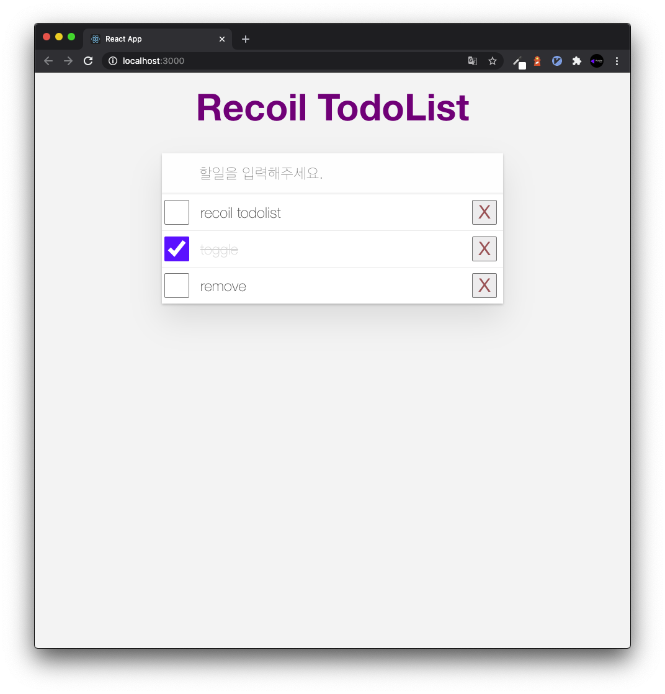

> Recoil을 활용하여 TodoList 만들어보기

## Recoil?

`Recoil`은 새로운 React 상태 관리 라이브러리이며, 최근 React Europe 2020이라는 행사에서 `Recoil`이라는 리액트의 새로운 상태관리
라이브러리로 등장하였습니다. 이러한 등장은 여러가지 이유로 주목을 받고 있는데, 가장 큰 이유는 React를 개발한 Facebook에서 만든 상태관리 라이브러리
이기 때문입니다.

기존에 사용하는 `Redux`, `MobX` 등은 React만을 위한 상태관리 라이브러리가 아니며 다른 환경에서도 사용가능 했었습니다.

이와 달리`Recoil`라는 리액트 전용 상태관리 라이브러리이며 내부적으로 React의 상태를 사용하고 있으며 React의 `Hooks`문법에도 최적화 되어 있는 라이브러리입니다.

## 그럼 ContextAPI 는?

아마 위의 내용을 보시고, `ContextAPI`를 생각하시는 분들이 많을 것 같습니다. 하지만 `ContextAPI`를 사용해보신 분들은 아시겠지만 단점과 한계가 정말 많습니다.

반복적이고 복잡한 상태관리를 하면 `Provider`를 많이 많들고 이를 계속 트리형태로 만들어주어야 하며, 해당 `Context`를 구독하는
하위의 모든 것이 상태가 변할 때마다 새롭게 렌더링 되는 단점이 있을 것입니다.

## Recoil TodoList 만들기

`Recoil`의 공식 홈페이지에 들어가면 TodoList 를 만드는 간단한 코드가 적혀있지만 이것을 조금 더 응용해서 새로운
TodoList 를 만들어보도록 하겠습니다.

먼저 `CRA`를 이용해서 React 애플리케이션을 만들어줍니다.

```
npx create-react-app recoil-todolist
```

생성한 프로젝트에 `Recoil`을 설치합니다.

```
npm install recoil
```

이제 TodoList 만들 준비를 다 했으니 `Recoil`을 사용할 수 있도록 합시다.

`Recoil`을 사용하려면 `Redux`의 `Provider`와 마찬가지로 최상단에 `RecoilRoot`를 설정해주어야 합니다.

**`index.js`**

```jsx
import React from 'react'
import ReactDOM from 'react-dom'
import { RecoilRoot } from 'content/blog/react/recoil-todolist'
import './index.css'
import App from './App'

ReactDOM.render(
  <React.StrictMode>
    <RecoilRoot>
      <App />
    </RecoilRoot>
  </React.StrictMode>,
  document.getElementById('root')
)
```

저희는 최상단인 `index.js`에서 작업을 해주고 `App.js`에서 작업을 해줄 예정이어서 App을 `RecoilRoot`로 감싸주었습니다.

그 다음으로 `Recoil`에서 중요한 개념인 `Atom`을 사용해서 TodoList의 상태를 만들어주도록 하겠습니다. 여기서 `atom`이란 하나의 상태라고 볼 수 있으며, 컴포넌트가 구독할 수 있는
React state라고 생각하면 됩니다. `atom`의 값을 변경하게 되면 이것을 구독하고 있는 여러 컴포넌트들이 모두 리렌더링 됩니다.

**`recoil/todos.js`**

```jsx
import { atom } from 'content/blog/react/recoil-todolist'

export const todosState = atom({
  key: 'todos',
  default: [],
})
```

이렇게 쉽게 상태를 만들어줄 수 있습니다. `atom`은 `key`와 `default`로 구성되어 있으며 `key`는 `atom`을 구분하기 위한 것이며,
`default`는 기본값을 의미합니다.

이제 상태를 만들어줬으니 새로운 `todo`를 추가해보도록 하겠습니다. 모든 코드에서 `styled-components`를 사용하여 스타일을 입혀주었지만,
포스팅에서는 해당 코드를 빼고 적도록 하며 포스팅 마지막 부분에서 전체 코드를 공유하도록 하겠습니다.

**`components/TodoInput.js`**

```jsx
import React, { useState } from 'react'
import styled from 'styled-components'
import { useSetRecoilState } from 'content/blog/react/recoil-todolist'
import { todosState } from '../recoil/todos'

let id = 0
const getId = () => id++

const TodoInput = () => {
  const setTodo = useSetRecoilState(todosState)
  const [text, setText] = useState('')

  const onChange = e => {
    setText(e.target.value)
  }

  const addTodo = () => {
    if (!text) {
      alert('정확한 값을 입력해주세요!')
      return
    }

    setTodo(todos => todos.concat({ id: getId(), text, completed: false }))
    setText('')
  }

  const onKeyDown = e => {
    if (e.key === 'Enter') {
      addTodo()
    }
  }

  return (
    <Input
      value={text}
      onChange={onChange}
      onKeyDown={onKeyDown}
      placeholder="할일을 입력해주세요."
      autoFocus
    />
  )
}

export default TodoInput
```

`Recoil`의 상태를 사용 및 변경할 때는 3가지를 이용합니다.

- _useRecoilState_ : `atom`값을 구독하여 업데이트 할 수 있는 hook으로 `useState`와 동일한 방식으로 사용합니다.
- _useRecoilValue_ : setter를 사용하지 않고 값만 사용할 때 사용합니다.
- _useSetRecoilState_ : setter만 사용할 경우 사용합니다.

`TodoInput.js`에서는 Enter키를 눌렀을 때 새로운 값을 추가시켜주기만 하면 되기 때문에 `useSetRecoilState`를 사용하였습니다.

이제 추가는 됬을테니 TodoList 를 화면에 그려주도록 하겠습니다.

**`components/TodoList.js`**

```jsx
import React from 'react'
import styled from 'styled-components'
import TodoItem from './TodoItem'
import { useRecoilValue } from 'content/blog/react/recoil-todolist'
import { todosState } from '../recoil/todos'

const TodoList = () => {
  const todos = useRecoilValue(todosState)

  return (
    <Container>
      <ListContainer>
        {todos.map(todo => (
          <TodoItem key={todo.id} data={todo} />
        ))}
      </ListContainer>
    </Container>
  )
}

export default TodoList
```

여기서는 아직 만들어주지 않았지만 `useRecoilValue`를 사용하여 상태를 불러오고 TodoItem을 이용하여 화면에 그려주도록 구성하였습니다.

이제 마지막으로 삭제, 토글, 출력을 모두 담당하는 `TodoItem.js`를 만들어주도록 합시다.

**`components/TodoItem.js`**

```jsx
import React from 'react'
import styled, { css } from 'styled-components'
import { useSetRecoilState } from 'content/blog/react/recoil-todolist'
import { todosState } from '../recoil/todos'

const TodoItem = ({ data }) => {
  const setTodos = useSetRecoilState(todosState)

  const toggleTodo = () => {
    setTodos(todos =>
      todos.map(todo =>
        todo.id === data.id ? { ...data, completed: !data.completed } : todo
      )
    )
  }

  const removeTodo = () => {
    setTodos(todos => todos.filter(todo => todo.id !== data.id))
  }

  return (
    <Container completed={data.completed}>
      <ToggleButton type="checkbox" onClick={toggleTodo} />
      <Text>{data.text}</Text>
      <DestroyButton onClick={removeTodo}>X</DestroyButton>
    </Container>
  )
}

export default TodoItem
```

`TodoItem.js`에서도 추가와 마찬가지로 `useSetRecoilState`를 이용하여 setter함수만 가지고 와서 토글과 삭제기능을 구현하였습니다.

마지막으로 `App.js`에서 위 컴포넌트들을 모두 넣어주었습니다.

**`App.js`**

```jsx
import React from 'react'
import styled from 'styled-components'

import TodoInput from './components/TodoInput'
import TodoList from './components/TodoList'

function App() {
  return (
    <Container>
      <Title>Recoil TodoList</Title>
      <TodoInput />
      <TodoList />
    </Container>
  )
}

export default App
```

이제 TodoList를 완성하였습니다. 결과물을 보도록 하겠습니다.



## 마무리 😎

이렇게 `Recoil`을 사용하여 TodoList를 완성시켜보았습니다. 

사용해본 후기는 `Redux`나 따른 상태관리 라이브러리들보다 훨씬 편하고 쉽게 느껴졌습니다. 현재는 아직 현업에서 사용하기에는 부족하지만 React 개발자분들은
`Recoil`에 관심을 계속 가지고 있으면 가까운 미래에 더 편하게 상태관리를 할 수 있지 않을까 생각합니다..!😁

스타일이 들어가 있는 전체코드는 [여기](https://github.com/purplecode2020/recoil_todolist)에서 확인 가능합니다.
